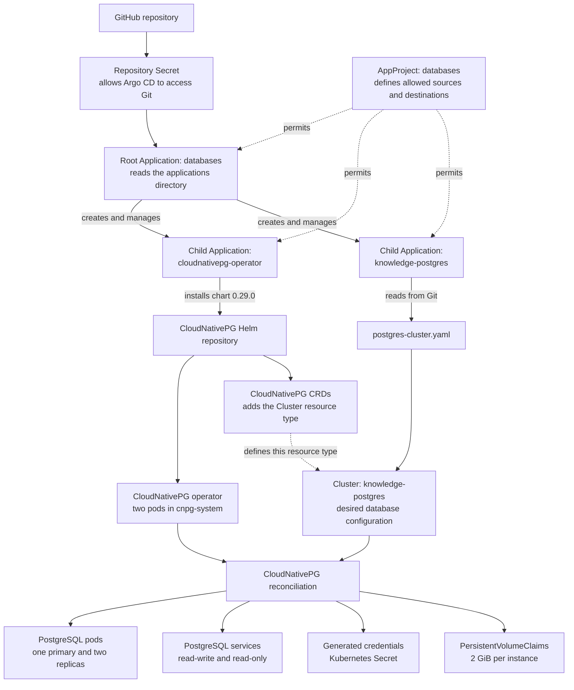

# CloudNativePG GitOps deployment

This directory contains the declarative CloudNativePG deployment for the
Document Knowledge Store. Argo CD installs the CloudNativePG operator and then
creates a three-instance PostgreSQL cluster.

CloudNativePG runs standard PostgreSQL. Its operator watches the CloudNativePG
`Cluster` resource and creates and maintains the PostgreSQL pods, services,
secrets, failover configuration, and persistent volumes.

## Architecture

The deployment uses Argo CD's app-of-apps pattern:

```text
AppProject: databases
|
`-- Root Application: databases
    |
    |-- Child Application: cloudnativepg-operator
    |   `-- CloudNativePG Helm chart 0.29.0
    |       `-- Two operator replicas in cnpg-system
    |
    `-- Child Application: knowledge-postgres
        `-- cluster/postgres-cluster.yaml
            `-- Three PostgreSQL instances in databases
```

The root Application creates and manages the two child Argo CD Applications.
The child Applications manage the operator and the PostgreSQL cluster. The
CloudNativePG operator then turns the `knowledge-postgres` Cluster resource into
the actual database pods and supporting resources.

### Beginner deployment flow



Read the diagram from top to bottom:

1. The AppProject grants permission; it does not deploy resources itself.
2. The root Application creates the two child Applications.
3. The operator Application installs CloudNativePG and its CRDs.
4. The cluster Application creates the `knowledge-postgres` Cluster resource.
5. The operator observes that Cluster resource and creates the PostgreSQL
   runtime resources.

## Repository layout

```text
gitops/
|-- cloudnative-postgres/
|   |-- root-application.yaml
|   |-- applications/
|   |   |-- cloudnativepg-operator.yaml
|   |   `-- postgres-cluster-application.yaml
|   |-- cluster/
|   |   `-- postgres-cluster.yaml
|   `-- README.md
|-- projects/
|   `-- database.yaml
`-- repository/
    `-- repository.yaml
```

No Kustomization is required. The root Application points directly to
`gitops/cloudnative-postgres/applications`, which contains only child
Application manifests.

## Namespace and project names

The configuration deliberately uses different namespaces for control-plane and
database workloads:

| Item | Name | Purpose |
| --- | --- | --- |
| Argo CD namespace | `argocd` | Stores the root and child Application resources. |
| Argo CD AppProject | `databases` | Groups the Applications and restricts their permissions. |
| Operator namespace | `cnpg-system` | Runs the CloudNativePG operator replicas and webhook service. |
| PostgreSQL namespace | `databases` | Runs the PostgreSQL instances, Services, Secrets, and PVCs. |

The AppProject name and PostgreSQL namespace happen to use the same value,
`databases`, but they are different Kubernetes resources with different roles.

## Current configuration

### Database AppProject

`gitops/projects/database.yaml` creates the `databases` AppProject in `argocd`.

It allows these sources:

- `https://cloudnative-pg.github.io/charts`
- `https://github.com/prathamesh8266/DOCUMENT-KNOWLEDGE-STORE.git`

It allows these destinations:

- `argocd` for the child Application resources created by the root Application.
- `cnpg-system` for the CloudNativePG operator.
- `databases` for the PostgreSQL cluster.

It permits the cluster-scoped resources required by the operator:

- `Namespace`
- `CustomResourceDefinition`
- `ClusterRole`
- `ClusterRoleBinding`
- `MutatingWebhookConfiguration`
- `ValidatingWebhookConfiguration`

These entries grant Argo CD permission within this AppProject. They do not
create those resources by themselves.

### Root Application

`gitops/cloudnative-postgres/root-application.yaml` creates an Application named
`databases` in `argocd`.

Its source is:

```text
Repository: https://github.com/prathamesh8266/DOCUMENT-KNOWLEDGE-STORE.git
Revision:   master
Path:       gitops/cloudnative-postgres/applications
```

Every YAML file in that source directory is an Argo CD `Application`, which is
why this is called the app-of-apps pattern.

### Operator Application

`applications/cloudnativepg-operator.yaml` installs:

```text
Helm repository: https://cloudnative-pg.github.io/charts
Chart:           cloudnative-pg
Chart version:   0.29.0
Helm release:      cloudnative-pg
Namespace:       cnpg-system
Replicas:        2
```

Operator resources:

```text
Requests: 100m CPU, 128Mi memory
Limits:   200m CPU, 256Mi memory
PodMonitor: disabled
```

Two replicas provide operator availability. Only one replica holds the leader
lease and actively reconciles resources; the second is a standby.

### PostgreSQL cluster Application

`applications/postgres-cluster-application.yaml` reads Kubernetes manifests
from:

```text
Repository: https://github.com/prathamesh8266/DOCUMENT-KNOWLEDGE-STORE.git
Revision:   master
Path:       gitops/cloudnative-postgres/cluster
Destination namespace: databases
```

The Application retries an unsuccessful initial synchronization up to ten
times. `SkipDryRunOnMissingResource=true` lets the cluster Application wait for
the operator's CRDs during a clean installation.

### PostgreSQL cluster

`cluster/postgres-cluster.yaml` creates:

```text
Namespace:          databases
Cluster name:       knowledge-postgres
Instances:          3 (one primary and two replicas)
Initial database:   knowledge_platform
Application owner:  app_user
StorageClass:       standard
Storage per pod:    2Gi
```

Each PostgreSQL instance requests `100m` CPU and `256Mi` memory and is limited
to `500m` CPU and `512Mi` memory.

## Prerequisites

Before deploying, confirm:

- The Kind Kubernetes cluster is running.
- `kubectl` uses the intended cluster context.
- All Kubernetes nodes are `Ready`.
- Argo CD is installed in `argocd`.
- A StorageClass named `standard` exists.
- The Git repository is reachable from Argo CD.
- There is no duplicate manually installed CloudNativePG operator.

Run:

```powershell
kubectl config current-context
kubectl get nodes
kubectl get namespace argocd
kubectl get storageclass
helm list -n cnpg-system
kubectl get deployments,pods -n cnpg-system
```

For this local environment, the expected context is `kind-rag-cluster`, all four
nodes should be `Ready`, and `standard` should be the default StorageClass.

### Check for an older manual installation

There must be only one CloudNativePG operator installation. A manual Helm
release named `cnpg` and an Argo-managed Deployment named `cloudnative-pg`
indicate duplicate installations that will compete for the same leader lease.

Check before deployment:

```powershell
helm list -n cnpg-system
kubectl get clusters.postgresql.cnpg.io -A
```

If a manual `cnpg` release exists, first confirm that no PostgreSQL Cluster
resources or data depend on it. Only then remove it:

```powershell
helm uninstall cnpg -n cnpg-system
```

## Deployment

### Step 1: Commit and push the desired state

Argo CD reads `master` from GitHub, not uncommitted local files. Commit and push
all configuration before creating the root Application:

```powershell
git status
git add gitops
git commit -m "configure CloudNativePG GitOps deployment"
git push origin master
```

Confirm the expected files exist on the remote branch:

```powershell
git ls-tree -r origin/master --name-only
```

The output must include:

```text
gitops/cloudnative-postgres/root-application.yaml
gitops/cloudnative-postgres/applications/cloudnativepg-operator.yaml
gitops/cloudnative-postgres/applications/postgres-cluster-application.yaml
gitops/cloudnative-postgres/cluster/postgres-cluster.yaml
gitops/projects/database.yaml
gitops/repository/repository.yaml
```

### Step 2: Register the repository

The repository Secret tells Argo CD about the Git repository:

```powershell
kubectl apply -f gitops/repository/repository.yaml
kubectl get secret document-knowledge-store-repository -n argocd
```

The repository is currently public, so no username, password, token, or SSH key
is stored in this Secret. Never commit repository credentials.

### Step 3: Create or update the AppProject

The AppProject must exist before the root Application because the root refers to
`project: databases`:

```powershell
kubectl apply -f gitops/projects/database.yaml
kubectl get appproject databases -n argocd
```

Review its effective configuration when troubleshooting permissions:

```powershell
kubectl describe appproject databases -n argocd
```

### Step 4: Bootstrap the root Application

Apply only the root Application:

```powershell
kubectl apply -f gitops/cloudnative-postgres/root-application.yaml
```

The standard Argo CD resource finalizer may produce a Kubernetes warning that
recommends a finalizer name containing a slash. The Application is successfully
created when the command prints:

```text
application.argoproj.io/databases created
```

The finalizer is retained so deleting an Application can cascade to the
resources it manages.

Do not manually apply the two files under `applications/`. The root Application
creates and manages them from Git.

### Step 5: Watch Argo CD reconciliation

Watch all Applications:

```powershell
kubectl get applications -n argocd -w
```

Expected Applications:

```text
databases
cloudnativepg-operator
knowledge-postgres
```

The desired final state is `Synced` and `Healthy` for all three. Press `Ctrl+C`
after they are healthy.

For details:

```powershell
kubectl describe application databases -n argocd
kubectl describe application cloudnativepg-operator -n argocd
kubectl describe application knowledge-postgres -n argocd
```

The operator may become healthy before the PostgreSQL cluster. Initial image
downloads and database initialization can take several minutes.

## Verification

### Verify the operator

```powershell
kubectl get deployments,pods,services -n cnpg-system
kubectl get crd clusters.postgresql.cnpg.io
kubectl get lease -n cnpg-system
```

Expected operator state:

- One `cloudnative-pg` Deployment.
- Two ready `cloudnative-pg-*` pods.
- The CloudNativePG CRDs exist.
- One operator pod holds the leader lease.

### Verify PostgreSQL

```powershell
kubectl get cluster knowledge-postgres -n databases
kubectl get pods -n databases -o wide
kubectl get services -n databases
kubectl get pvc -n databases
kubectl get secrets -n databases
kubectl get events -n databases --sort-by=.lastTimestamp
```

Expected database state:

- The `knowledge-postgres` Cluster reports a healthy phase.
- Three PostgreSQL instance pods are running.
- Each PostgreSQL instance has a bound 2 GiB PVC.
- `knowledge-postgres-rw` points to the writable primary.
- `knowledge-postgres-ro` provides read-only replica access.
- `knowledge-postgres-r` provides access to all instances.
- `knowledge-postgres-app` contains application credentials.

For additional status information:

```powershell
kubectl describe cluster knowledge-postgres -n databases
```

## Database credentials

CloudNativePG generates the application credentials in the
`knowledge-postgres-app` Secret. Decode them in PowerShell without writing them
to a file:

```powershell
$encodedUsername = kubectl get secret knowledge-postgres-app -n databases -o jsonpath="{.data.username}"
$databaseUsername = [System.Text.Encoding]::UTF8.GetString([System.Convert]::FromBase64String($encodedUsername))

$encodedPassword = kubectl get secret knowledge-postgres-app -n databases -o jsonpath="{.data.password}"
$databasePassword = [System.Text.Encoding]::UTF8.GetString([System.Convert]::FromBase64String($encodedPassword))

$databaseUsername
$databasePassword
```

Do not put decoded credentials in Git, a ConfigMap, logs, or documentation.

## Connect from the local computer

Start a port-forward to the read-write service:

```powershell
kubectl port-forward -n databases service/knowledge-postgres-rw 5432:5432
```

Keep that terminal open. In another terminal with `psql` installed:

```powershell
$encodedPassword = kubectl get secret knowledge-postgres-app -n databases -o jsonpath="{.data.password}"
$env:PGPASSWORD = [System.Text.Encoding]::UTF8.GetString([System.Convert]::FromBase64String($encodedPassword))
psql --host 127.0.0.1 --port 5432 --username app_user --dbname knowledge_platform
```

Application services running inside Kubernetes should connect through:

```text
Host:     knowledge-postgres-rw.databases.svc.cluster.local
Port:     5432
Database: knowledge_platform
Username: app_user
Password: value from the knowledge-postgres-app Secret
```

Applications should consume the Kubernetes Secret directly instead of
hard-coding the password.

## GitOps behavior

The root and child Applications enable automated synchronization:

```yaml
syncPolicy:
  automated:
    prune: true
    selfHeal: true
```

- `selfHeal` restores managed resources that are changed manually.
- `prune` deletes managed resources that are removed from the source.
- `ServerSideApply` lets the Kubernetes API server manage field ownership.
- `CreateNamespace` creates a destination namespace when necessary.

After the initial bootstrap, changes follow this process:

1. Edit a manifest in Git.
2. Commit and push the change to `master`.
3. Argo CD detects the new commit.
4. Argo CD synchronizes the affected Application.
5. CloudNativePG reconciles changes to the PostgreSQL Cluster resource.

Do not manually modify operator-managed PostgreSQL Deployments, Pods, Services,
Secrets, or PVCs. Change `cluster/postgres-cluster.yaml` and let the controllers
reconcile it.

## Updating configurations

### Update the PostgreSQL cluster

Edit:

```text
gitops/cloudnative-postgres/cluster/postgres-cluster.yaml
```

Commit and push, then watch:

```powershell
kubectl get application knowledge-postgres -n argocd
kubectl get cluster knowledge-postgres -n databases
kubectl get pods,pvc -n databases
```

### Update the operator chart

Change `targetRevision` in:

```text
gitops/cloudnative-postgres/applications/cloudnativepg-operator.yaml
```

Because the root Application manages this child Application, committing and
pushing the change is sufficient. Review CloudNativePG release notes and back up
important databases before operator upgrades.

### Update the AppProject or repository registration

The root Application does not manage `gitops/projects/database.yaml` or
`gitops/repository/repository.yaml`. After changing either bootstrap file, apply
it again:

```powershell
kubectl apply -f gitops/repository/repository.yaml
kubectl apply -f gitops/projects/database.yaml
```

## Troubleshooting

### Root Application is invalid

Check that the `databases` AppProject exists and permits `argocd` as a
destination:

```powershell
kubectl get appproject databases -n argocd
kubectl describe application databases -n argocd
```

### Child Applications do not appear

Confirm that the root source directory exists in the remote branch:

```powershell
git ls-tree -r origin/master --name-only
kubectl describe application databases -n argocd
```

The remote branch must contain both files under:

```text
gitops/cloudnative-postgres/applications
```

### Application destination is not permitted

The values must match exactly:

```text
Root destination:       argocd
Operator destination:   cnpg-system
PostgreSQL destination: databases
```

All three destinations must be listed in the `databases` AppProject.

### No matches for kind Cluster

The CloudNativePG CRD is missing or not ready:

```powershell
kubectl get application cloudnativepg-operator -n argocd
kubectl get crd clusters.postgresql.cnpg.io
kubectl get pods -n cnpg-system
```

The cluster Application is configured to retry and skip its initial dry run
while the CRD is being installed.

### Operator is running but PostgreSQL is absent

The operator does not create a database until the Cluster resource exists:

```powershell
kubectl get application knowledge-postgres -n argocd
kubectl get clusters.postgresql.cnpg.io -A
kubectl get events -n databases --sort-by=.lastTimestamp
```

### More than two operator pods exist

Check for a duplicate Helm installation:

```powershell
helm list -n cnpg-system
kubectl get deployments,pods -n cnpg-system
kubectl get lease -n cnpg-system
```

The expected deployment is `cloudnative-pg` with two replicas.

### PostgreSQL pods remain Pending

Inspect storage and scheduling:

```powershell
kubectl get pvc -n databases
kubectl get storageclass
kubectl describe pods -n databases
kubectl get events -n databases --sort-by=.lastTimestamp
```

The current manifest requires the `standard` StorageClass.

### Admission webhook errors

```powershell
kubectl get pods,services -n cnpg-system
kubectl get validatingwebhookconfiguration,mutatingwebhookconfiguration
kubectl logs deployment/cloudnative-pg -n cnpg-system --tail=200
```

## Safety notes

- Do not commit database or repository credentials.
- Do not run a manual CloudNativePG Helm release alongside the Argo deployment.
- Review deletions carefully because automated pruning is enabled.
- The Application finalizers enable cascading deletion of managed resources.
- Deleting `knowledge-postgres` can delete database resources and may lead to
  data loss depending on storage retention settings.
- Back up important data before destructive tests, upgrades, or major changes.
